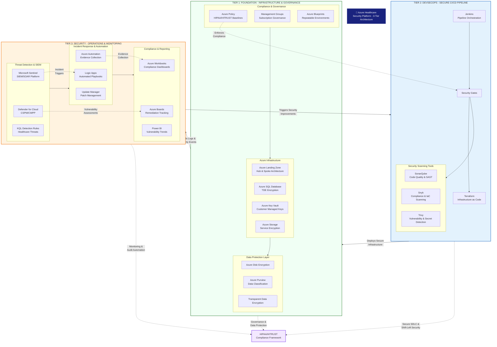

```markdown
# Azure Healthcare Security Platform: HITRUST/HIPAA Compliance

## Overview
A comprehensive Azure security engineering project designed to simulate a healthcare environment requiring HITRUST and HIPAA compliance. This project demonstrates end-to-end security implementation across cloud infrastructure, application development, and security operations.

## Project Context
This platform simulates the security requirements for a healthcare startup operating patient-facing applications on Azure. It addresses the full spectrum of cloud security, application security, security operations, and compliance automation needed for regulated healthcare environments.

## Architecture Overview

The platform implements a three-tier security architecture that separates concerns while maintaining integrated workflows:

1. **Infrastructure & Governance Layer**: Azure native services for secure foundation
2. **DevSecOps Pipeline Layer**: CI/CD tools for secure deployment 
3. **Security Operations Layer**: Monitoring, detection, and compliance automation

This separation allows for scalable security controls while maintaining the continuous improvement loop essential for healthcare compliance.



## Project Structure

```
.
├── Jenkinsfile                      # Jenkins pipeline configuration
├── main.tf                          # Root Terraform configuration
├── providers.tf                     # Azure provider configuration
├── variables.tf                     # Terraform variables
├── terraform.tfvars                 # Environment-specific variables
├── outputs.tf                       # Terraform output definitions
├── scripts/
│   ├── evidence_collector.py        # Automated evidence collection
│   └── hipaa-compliance-report.py   # HIPAA compliance reporting
├── modules/                         # Terraform modules
│   ├── landing_zone/                # Azure Landing Zone implementation
│   ├── networking/                  # Hub & Spoke network architecture
│   ├── database/                    # Azure SQL with TDE encryption
│   │   ├── audit.tf                 # SQL auditing configuration
│   │   ├── tde.tf                   # Transparent Data Encryption
│   │   └── keyvault-access.tf       # Key Vault integration
│   ├── entra_id/                    # Entra ID with PIM simulation
│   ├── security/                    # Security controls and policies
│   ├── sentinel/                    # Microsoft Sentinel configuration
│   │   └── healthcare_analytics.tf  # Healthcare-specific KQL rules
│   ├── monitoring/                  # Monitoring and alerting
│   │   └── workbooks.tf             # Azure Workbooks for compliance
│   ├── compliance/                  # Compliance automation
│   ├── hitrust_automation/          # HITRUST evidence collection
│   └── data_protection/             # Data encryption and protection
└── Screenshots/                     # Pipeline execution and validation screenshots
    ├── Jenkins-Terraform-Pipeline-*.png  # Jenkins pipeline execution
    ├── Trivy-*.png                  # Vulnerability scanning results
    └── Terraform-Remediation-*.png  # Security remediation evidence
```

## Key Components

### Jenkins CI/CD Pipeline
- **Location**: Separate VM hosting Jenkins server
- **Configuration**: `Jenkinsfile` defines multi-stage security pipeline
- **Security Gates**: 
  - **SonarQube**: Static code analysis for Terraform HCL
  - **Snyk**: Infrastructure as Code compliance scanning
  - **Trivy**: Vulnerability and secret detection
- **Pipeline Flow**: Code → Security Scanning → Terraform Validation → Azure Deployment

### Terraform Infrastructure
- **Root Configuration**: `main.tf` orchestrates all modules
- **Modular Design**: Separate modules for each architectural component
- **Compliance-First**: All modules include HIPAA/HITRUST controls
- **State Management**: Secure state file with encryption

### Security Validation
- **Pre-Deployment**: All infrastructure validated before deployment
- **Shift-Left Security**: Security scanning integrated into CI/CD
- **Automated Remediation**: Security findings trigger automated fixes
- **Compliance Evidence**: Screenshots and logs captured for audits

## Architecture Phases

### Phase 1: Azure Landing Zone with HITRUST Controls
**Focus**: Cloud security architecture, compliance, and governance
- Azure Enterprise Scale Landing Zone deployed with Terraform
- Azure Policy implementation for CIS/NIST/HIPAA compliance baselines
- Management Groups and Subscription governance structure
- Azure Blueprints for repeatable HITRUST-aligned environments

### Phase 2: Infrastructure-as-Code Security Integration
**Focus**: Shift-left security and compliance validation for Terraform-based Azure infrastructure
- Jenkins CI/CD pipeline with integrated security scanning for Terraform infrastructure
- Security tools: Snyk (compliance scanning), Trivy (vulnerability/secret detection), SonarQube (code quality analysis)
- Automated validation of Azure Landing Zone configurations against HIPAA/HITRUST requirements
- Pre-deployment scanning of encryption settings (TDE, storage encryption) and Key Vault access policies
- Network security validation and secret exposure prevention in infrastructure code

### Phase 3: Vulnerability Management Lifecycle
**Focus**: Vulnerability management and risk prioritization
- Microsoft Defender for Cloud vulnerability assessment configuration
- Integration with Azure DevOps Boards for automated ticket creation
- Risk prioritization matrix based on CVSS and business context
- Automated patch management with Azure Update Manager
- Power BI dashboard for vulnerability trends and compliance tracking

### Phase 4: Security Operations & MDR Integration
**Focus**: MDR configuration, incident management, and monitoring
- Microsoft Sentinel deployment as SIEM
- Microsoft Defender for Endpoint (EDR) integration
- Custom KQL detection rules for healthcare-specific threats
- Incident response playbooks with Azure Logic Apps
- Third-party MDR solution integration simulation
- Just-in-time access implementation with Azure AD PIM

### Phase 5: Data Protection & Encryption
**Focus**: Encryption, key management, and patient data protection
- Azure Disk Encryption for VMs
- Azure Storage Service Encryption with customer-managed keys
- Azure SQL Transparent Data Encryption
- Azure Purview for data classification and PII discovery
- Azure Policy enforcement for encryption on all resources

### Phase 6: HITRUST Certification Automation
**Focus**: Audit support, evidence collection, and control testing
- Azure Policy controls mapped to HITRUST requirements
- Automated evidence collection with Azure Automation
- Compliance dashboard with Azure Workbooks
- Control testing automation scripts
- Remediation tracking with Azure Boards

## Technologies Demonstrated

### Azure Security Services
- Microsoft Defender for Cloud (CSPM/CWPP)
- Microsoft Sentinel (SIEM/SOAR)
- Azure Key Vault (Key Management)
- Azure Policy (Governance)
- Azure Purview (Data Governance)

### Infrastructure & DevOps Tools
- Terraform (Infrastructure as Code)
- Jenkins (CI/CD Orchestration on separate VM)
- SonarQube (Code Quality & SAST)
- Snyk (Compliance & IaC Scanning)
- Trivy (Vulnerability & Secret Detection)

### Security Operations & Compliance
- Azure Logic Apps (Automation & Playbooks)
- Azure Automation (Evidence Collection)
- Azure Workbooks (Compliance Dashboards)
- Azure Boards (Remediation Tracking)
- Power BI (Reporting & Analytics)
- KQL (Threat Detection Queries)

## Getting Started

### Prerequisites
1. Azure Subscription with appropriate permissions
2. Jenkins server (separate VM) with required plugins
3. Security tooling (SonarQube, Snyk, Trivy) configured
4. Terraform CLI installed

### Deployment Steps
1. **Clone Repository**: `git clone <repository-url>`
2. **Configure Jenkins**: 
   - Import `Jenkinsfile` into Jenkins
   - Configure credentials for Azure and security tools
   - Set up webhook for automated pipeline triggering
3. **Configure Terraform Variables**:
   - Update `terraform.tfvars` with your Azure configuration
   - Set environment-specific variables
4. **Run Pipeline**:
   - Trigger Jenkins pipeline manually or via webhook
   - Monitor security scanning stages
   - Review and approve deployment
5. **Validate Deployment**:
   - Check Azure Portal for deployed resources
   - Verify security controls are active
   - Run compliance validation scripts

### Pipeline Execution
```bash
# Jenkins Pipeline Stages:
1. Checkout Code
2. Terraform Init & Validate
3. Security Scanning (SonarQube, Snyk, Trivy)
4. Terraform Plan & Security Review
5. Manual Approval Gate
6. Terraform Apply
7. Post-Deployment Validation
8. Evidence Collection
```

## Screenshots
The `Screenshots/` directory contains visual evidence of:
- Jenkins pipeline execution with security gates
- Terraform code validation and remediation
- Trivy vulnerability scanning results
- Security misconfiguration findings and fixes
- Compliance validation reports

## Implementation Approach
This project demonstrates practical implementation of security controls across the entire technology stack, from infrastructure to application code. Each phase builds upon the previous to create a layered security approach suitable for healthcare environments.

The three-tier architecture ensures:
- **Separation of concerns** between infrastructure, deployment, and operations
- **Continuous security improvement** through feedback loops
- **Scalable controls** that can grow with the organization
- **Automated compliance** through policy-as-code and security-as-code

## Use Cases
- Healthcare organizations migrating to Azure
- Companies requiring HITRUST/HIPAA compliance
- Security engineers building comprehensive cloud security programs
- DevOps teams implementing security into CI/CD pipelines
- Security operations teams building detection and response capabilities
- Compliance teams automating audit evidence collection

## Disclaimer
This project is for educational and demonstration purposes. It represents security patterns and architectures but should be reviewed and adapted by qualified security professionals for production use. Compliance requirements may vary based on specific regulatory interpretations and organizational contexts.

Always consult with legal and compliance teams when implementing security controls for regulated environments.
```